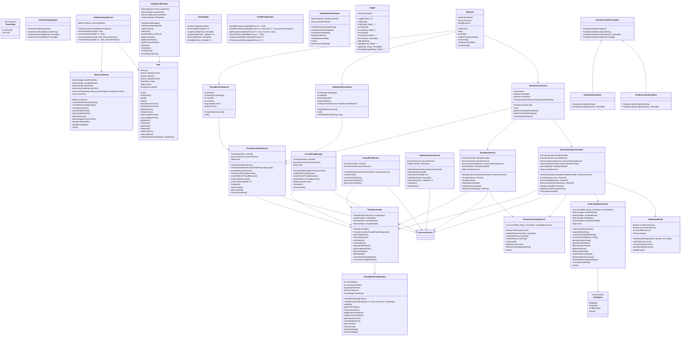

# Thread Controller Class Diagram

```mermaid
classDiagram
    %% Enumerations
    class ThreadType {
        <<enumeration>>
        PLATFORM
        VIRTUAL
    }

    class TaskStatus {
        <<enumeration>>
        PENDING
        RUNNING
        COMPLETED
        FAILED
    }

    %% Core Models
    class ThreadPoolConfiguration {
        -int corePoolSize
        -int maximumPoolSize
        -long keepAliveTime
        -TimeUnit timeUnit
        -ThreadType threadType
        +ThreadPoolConfiguration()
        +ThreadPoolConfiguration(int, int, long, TimeUnit, ThreadType)
        +validate()
        +getCorePoolSize()
        +setCorePoolSize()
        +getMaximumPoolSize()
        +setMaximumPoolSize()
        +getKeepAliveTime()
        +setKeepAliveTime()
        +getTimeUnit()
        +setTimeUnit()
        +getThreadType()
        +setThreadType()
    }

    class Task {
        -String id
        -Instant submissionTime
        -Instant startTime
        -Instant completionTime
        -TaskStatus status
        -Object result
        -Exception exception
        +Task()
        +Task(String)
        +getId()
        +setId()
        +getSubmissionTime()
        +setSubmissionTime()
        +getStartTime()
        +setStartTime()
        +getCompletionTime()
        +setCompletionTime()
        +getStatus()
        +setStatus()
        +getResult()
        +setResult()
        +getException()
        +setException()
        -isValidTransition(TaskStatus, TaskStatus)
    }

    class ThreadController {
        -ThreadPoolConfiguration configuration
        -volatile boolean isShutdown
        -AtomicInteger submittedTasks
        -AtomicInteger completedTasks
        +ThreadController()
        +ThreadController(ThreadPoolConfiguration)
        +getConfiguration()
        +setConfiguration()
        +isShutdown()
        +setShutdown()
        +getSubmittedTasks()
        +getCompletedTasks()
        +getThreadType()
        +getPoolSize()
        +incrementSubmittedTasks()
        +incrementCompletedTasks()
    }

    %% Service Layer
    class ThreadControllerService {
        -ThreadController controller
        -ExecutorService executorService
        -Object lock
        +ThreadControllerService()
        +ThreadControllerService(ThreadPoolConfiguration)
        -initializeExecutorService()
        -createVirtualThreadExecutor()
        -createPlatformThreadExecutor()
        +submitTask(Runnable)
        +submitTask(Callable~T~)
        +shutdown()
        +isTerminated()
        +getController()
        +resizeThreadPool()
    }

    class ThreadPoolManager {
        -ThreadController controller
        -ExecutorService executorService
        -Object lock
        +ThreadPoolManager(ThreadController)
        +initializeExecutorService()
        -createVirtualThreadExecutor()
        -createPlatformThreadExecutor()
        +getExecutorService()
        +shutdown()
        +isTerminated()
    }

    class VirtualThreadSupport {
        +isVirtualThreadSupported()
        +createVirtualThreadExecutor(String)
        +createVirtualThread(String, Runnable)
        +startVirtualThread(String, Runnable)
    }

    class ThreadPoolResizer {
        -ThreadController controller
        -ExecutorService executorService
        +ThreadPoolResizer(ThreadController, ExecutorService)
        +resizePool(int)
        +increasePoolSize(int)
        +decreasePoolSize(int)
        +getCurrentPoolSize()
    }

    class TaskSubmissionService {
        -ExecutorService executorService
        -volatile boolean isShutdown
        +TaskSubmissionService(ExecutorService)
        +submitTask(Runnable)
        +submitTask(Callable~T~)
        +submitTask(Task, Runnable)
        +submitTask(Task, Callable~T~)
        +shutdown()
        +isShutdown()
    }

    class TaskExecutionService {
        -MetricsCollector metricsCollector
        +TaskExecutionService(MetricsCollector)
        +executeTask(Runnable, Task)
        +executeTask(Callable~T~, Task)
        +executeTask(Runnable, Task, ExecutorService)
        +executeTask(Callable~T~, Task, ExecutorService)
    }

    class TaskQueueManager {
        -BlockingQueue~Task~ taskQueue
        -AtomicInteger queuedTasks
        -AtomicInteger processedTasks
        -volatile boolean isShutdown
        +TaskQueueManager()
        +TaskQueueManager(int)
        +addTask(Task)
        +takeTask()
        +pollTask(long, TimeUnit)
        +getQueueSize()
        +getQueuedTasks()
        +getProcessedTasks()
        +isEmpty()
        +shutdown()
        +isShutdown()
        +remainingCapacity()
    }

    class TaskAdapter {
        +fromRunnable(Runnable)
        +fromCallable(Callable~T~)
        +wrapRunnable(Task, Runnable)
        +wrapCallable(Task, Callable~T~)
        +toRunnable(Task, Runnable)
        +toCallable(Task, Callable~T~)
    }

    class TaskResultHandler {
        +handleResult(CompletableFuture~T~, Task)
        +handleResult(CompletableFuture~T~, Consumer~T~, Consumer~Exception~)
        +getResult(CompletableFuture~T~, long, TimeUnit, Task)
        +cancelTask(CompletableFuture~?~, Task)
        +isTaskCompleted(CompletableFuture~?~)
        +isTaskCancelled(CompletableFuture~?~)
    }

    class ShutdownService {
        -ThreadController threadController
        -ExecutorService executorService
        -ResourceCleanupService resourceCleanupService
        -AtomicBoolean shutdownInitiated
        -Object shutdownLock
        +ShutdownService(ThreadController, ExecutorService)
        +shutdown(long, TimeUnit)
        +shutdownNow()
        +isShutdownInitiated()
        +isShutdownComplete()
        -awaitTermination(long, TimeUnit)
    }

    class GracefulShutdownHandler {
        -ThreadController threadController
        -ExecutorService executorService
        -ResourceCleanupService resourceCleanupService
        -TaskCompletionTracker taskCompletionTracker
        -AtomicBoolean shutdownInitiated
        -Object shutdownLock
        +GracefulShutdownHandler(ThreadController, ExecutorService)
        +shutdown(long, long, TimeUnit)
        -performShutdown(long, TimeUnit)
        -performAwaitTermination(long, TimeUnit)
        +getTaskCompletionTracker()
        +getResourceCleanupService()
        +isShutdownInitiated()
    }

    class ResourceCleanupService {
        -ConcurrentMap~String, Closeable~ managedResources
        +ResourceCleanupService()
        +registerResource(String, Closeable)
        +unregisterResource(String)
        +cleanupResource(String)
        +cleanupAll()
        +getResourceCount()
        +isResourceRegistered(String)
        +clear()
    }

    class TaskCompletionTracker {
        -ConcurrentMap~String, TaskStatus~ taskStatuses
        -AtomicInteger submittedTasks
        -AtomicInteger completedTasks
        -AtomicInteger failedTasks
        -AtomicBoolean shutdownInitiated
        -Object lock
        +TaskCompletionTracker()
        +registerTask(String)
        +markTaskCompleted(String)
        +markTaskFailed(String, String)
        +getTaskStatus(String)
        +getSubmittedTasks()
        +getCompletedTasks()
        +getFailedTasks()
        +getRunningTasks()
        +areAllTasksCompleted()
        +getCompletionSummary()
        +setShutdownInitiated(boolean)
        +isShutdownInitiated()
        +clear()
    }

    class TaskSubmissionGuard {
        -AtomicBoolean shutdownInitiated
        -String componentName
        +TaskSubmissionGuard(String)
        +checkSubmissionAllowed()
        +isSubmissionAllowed()
        +initiateShutdown()
        +isShutdownInitiated()
        +reset()
        +getComponentName()
    }

    %% Utility Classes
    class MetricsCollector {
        -AtomicInteger submittedTasks
        -AtomicInteger completedTasks
        -AtomicInteger failedTasks
        -AtomicLong totalExecutionTime
        -ConcurrentHashMap~String, AtomicInteger~ taskTypeCounters
        -Instant startTime
        +MetricsCollector()
        +recordTaskSubmission(String)
        +recordTaskCompletion(long)
        +recordTaskFailure()
        +getSubmittedTasks()
        +getCompletedTasks()
        +getFailedTasks()
        +getAverageExecutionTime()
        +getUptimeSeconds()
        +getMetricsReport()
        +reset()
    }

    class Logger {
        -String className
        +Logger(Class~?~)
        +info(String)
        +info(String, Object...)
        +warn(String)
        +warn(String, Object...)
        +error(String)
        +error(String, Object...)
        +error(String, Throwable)
        +debug(String)
        +debug(String, Object...)
        -log(String, String, Throwable)
        -formatMessage(String, Object...)
    }

    %% CLI Commands
    class CliParser {
        -boolean[] verbose
        -String command
        -String[] params
        +CliParser()
        +call()
        -printHelp()
        -createThreadController()
        -submitTask()
        -shutdownController()
        +main(String[])
    }

    class ThreadPoolCommand {
        -int poolSize
        -ThreadType threadType
        -int coreSize
        -int maxSize
        -long keepAliveTime
        -boolean resize
        +ThreadPoolCommand()
        +call()
    }

    class TaskSubmitCommand {
        -ThreadType threadType
        -int poolSize
        -long taskDuration
        -String taskName
        -ThreadControllerService threadControllerService
        +TaskSubmitCommand()
        +call()
        -createSimpleTask(String, long)
    }

    class ShutdownCommand {
        -long timeout
        -boolean immediate
        -boolean showStatus
        -ThreadControllerService threadControllerService
        +ShutdownCommand()
        +call()
        -performImmediateShutdown()
        -performGracefulShutdown()
        -showShutdownStatus()
    }

    %% Exception Classes
    class ThreadControllerException {
        +ThreadControllerException()
        +ThreadControllerException(String)
        +ThreadControllerException(String, Throwable)
        +ThreadControllerException(Throwable)
    }

    class ShutdownException {
        +ShutdownException(String)
        +ShutdownException(String, Throwable)
    }

    class TaskExecutionException {
        +TaskExecutionException(String)
        +TaskExecutionException(String, Throwable)
    }

    %% Relationships
    ThreadController --> ThreadPoolConfiguration
    ThreadControllerService --> ThreadController
    ThreadControllerService --> ExecutorService
    ThreadPoolManager --> ThreadController
    ThreadPoolManager --> ExecutorService
    ThreadPoolResizer --> ThreadController
    ThreadPoolResizer --> ExecutorService
    TaskSubmissionService --> ExecutorService
    TaskExecutionService --> MetricsCollector
    TaskExecutionService --> Task
    TaskQueueManager --> Task
    ShutdownService --> ThreadController
    ShutdownService --> ExecutorService
    ShutdownService --> ResourceCleanupService
    GracefulShutdownHandler --> ThreadController
    GracefulShutdownHandler --> ExecutorService
    GracefulShutdownHandler --> ResourceCleanupService
    GracefulShutdownHandler --> TaskCompletionTracker
    GracefulShutdownHandler --> ShutdownResult
    TaskCompletionTracker --> TaskStatus
    CliParser --> ThreadPoolCommand
    CliParser --> TaskSubmitCommand
    CliParser --> ShutdownCommand
    ThreadPoolCommand --> ThreadControllerService
    TaskSubmitCommand --> ThreadControllerService
    ShutdownCommand --> ThreadControllerService
    ShutdownCommand --> ShutdownService
    ShutdownCommand --> GracefulShutdownHandler
    ThreadControllerException <|-- ShutdownException
    ThreadControllerException <|-- TaskExecutionException

    class ShutdownResult {
        -boolean shutdownSuccess
        -boolean terminationSuccess
        -int cleanedResources
        -String message
        +ShutdownResult(boolean, boolean, int, String)
        +isShutdownSuccess()
        +isTerminationSuccess()
        +getCleanedResources()
        +getMessage()
    }
```