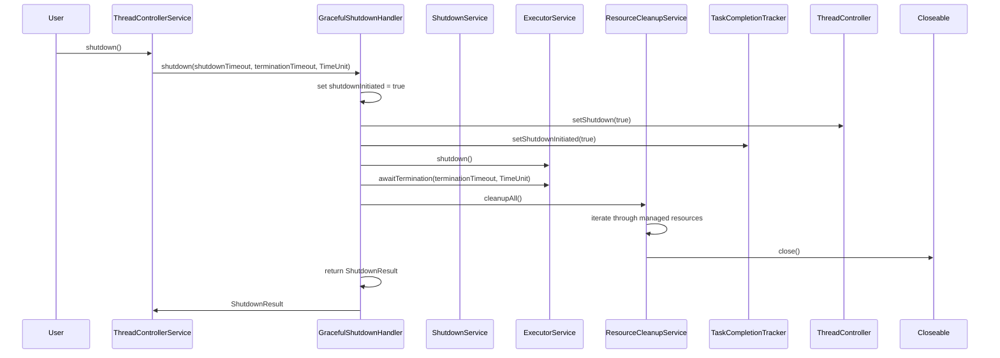

# Graceful Shutdown Flow

```mermaid
sequenceDiagram
    participant User
    participant ThreadControllerService
    participant GracefulShutdownHandler
    participant ShutdownService
    participant ExecutorService
    participant ResourceCleanupService
    participant TaskCompletionTracker

    User->>ThreadControllerService: shutdown()
    ThreadControllerService->>GracefulShutdownHandler: shutdown(shutdownTimeout, terminationTimeout, TimeUnit)
    GracefulShutdownHandler->>GracefulShutdownHandler: set shutdownInitiated = true
    GracefulShutdownHandler->>ThreadController: setShutdown(true)
    GracefulShutdownHandler->>TaskCompletionTracker: setShutdownInitiated(true)
    GracefulShutdownHandler->>ExecutorService: shutdown()
    GracefulShutdownHandler->>ExecutorService: awaitTermination(terminationTimeout, TimeUnit)
    GracefulShutdownHandler->>ResourceCleanupService: cleanupAll()
    ResourceCleanupService->>ResourceCleanupService: iterate through managed resources
    ResourceCleanupService->>Closeable: close()
    GracefulShutdownHandler->>GracefulShutdownHandler: return ShutdownResult
    GracefulShutdownHandler->>ThreadControllerService: ShutdownResult
```