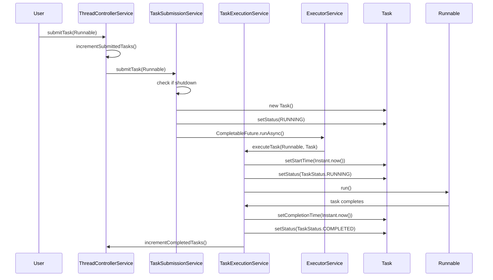

# Task Submission Flow

```mermaid
sequenceDiagram
    participant User
    participant ThreadControllerService
    participant TaskSubmissionService
    participant TaskExecutionService
    participant ExecutorService
    participant Task

    User->>ThreadControllerService: submitTask(Runnable)
    ThreadControllerService->>ThreadControllerService: incrementSubmittedTasks()
    ThreadControllerService->>TaskSubmissionService: submitTask(Runnable)
    TaskSubmissionService->>TaskSubmissionService: check if shutdown
    TaskSubmissionService->>Task: new Task()
    TaskSubmissionService->>Task: setStatus(RUNNING)
    TaskSubmissionService->>ExecutorService: CompletableFuture.runAsync()
    ExecutorService->>TaskExecutionService: executeTask(Runnable, Task)
    TaskExecutionService->>Task: setStartTime(Instant.now())
    TaskExecutionService->>Task: setStatus(TaskStatus.RUNNING)
    TaskExecutionService->>Runnable: run()
    Runnable->>TaskExecutionService: task completes
    TaskExecutionService->>Task: setCompletionTime(Instant.now())
    TaskExecutionService->>Task: setStatus(TaskStatus.COMPLETED)
    TaskExecutionService->>ThreadControllerService: incrementCompletedTasks()
```