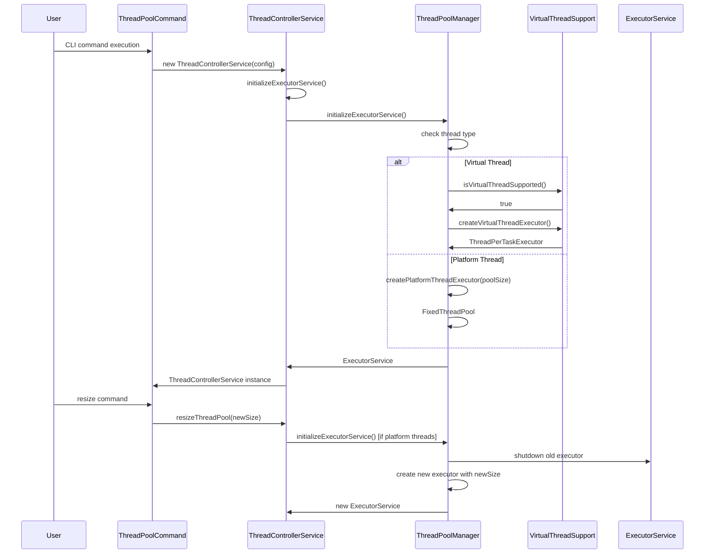

# Thread Pool Management Flow

```mermaid
sequenceDiagram
    participant User
    participant ThreadPoolCommand
    participant ThreadControllerService
    participant ThreadPoolManager
    participant VirtualThreadSupport

    User->>ThreadPoolCommand: CLI command execution
    ThreadPoolCommand->>ThreadControllerService: new ThreadControllerService(config)
    ThreadControllerService->>ThreadControllerService: initializeExecutorService()
    ThreadControllerService->>ThreadPoolManager: initializeExecutorService()
    ThreadPoolManager->>ThreadPoolManager: check thread type
    alt Virtual Thread
        ThreadPoolManager->>VirtualThreadSupport: isVirtualThreadSupported()
        VirtualThreadSupport->>ThreadPoolManager: true
        ThreadPoolManager->>VirtualThreadSupport: createVirtualThreadExecutor()
        VirtualThreadSupport->>ThreadPoolManager: ThreadPerTaskExecutor
    else Platform Thread
        ThreadPoolManager->>ThreadPoolManager: createPlatformThreadExecutor(poolSize)
        ThreadPoolManager->>ThreadPoolManager: FixedThreadPool
    end
    ThreadPoolManager->>ThreadControllerService: ExecutorService
    ThreadControllerService->>ThreadPoolCommand: ThreadControllerService instance

    User->>ThreadPoolCommand: resize command
    ThreadPoolCommand->>ThreadControllerService: resizeThreadPool(newSize)
    ThreadControllerService->>ThreadPoolManager: initializeExecutorService() [if platform threads]
    ThreadPoolManager->>ExecutorService: shutdown old executor
    ThreadPoolManager->>ThreadPoolManager: create new executor with newSize
    ThreadPoolManager->>ThreadControllerService: new ExecutorService
```